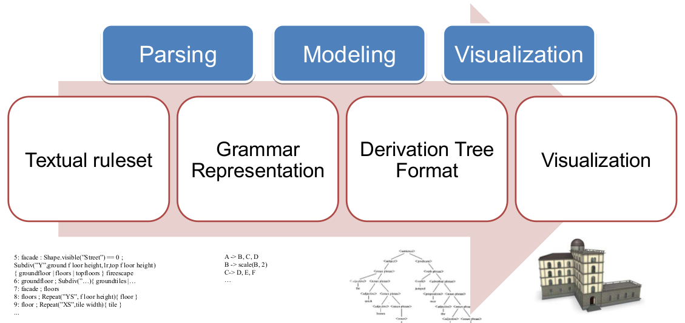
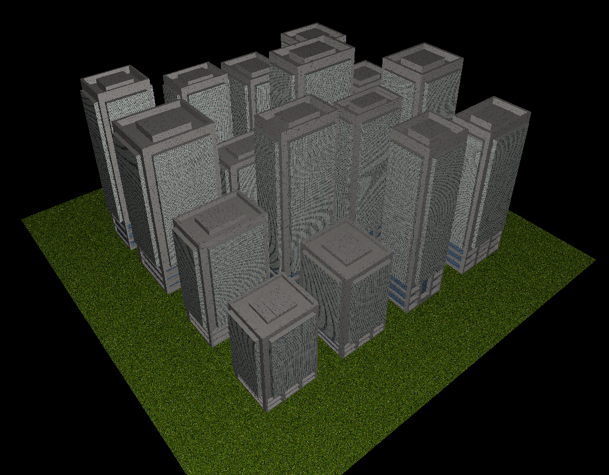
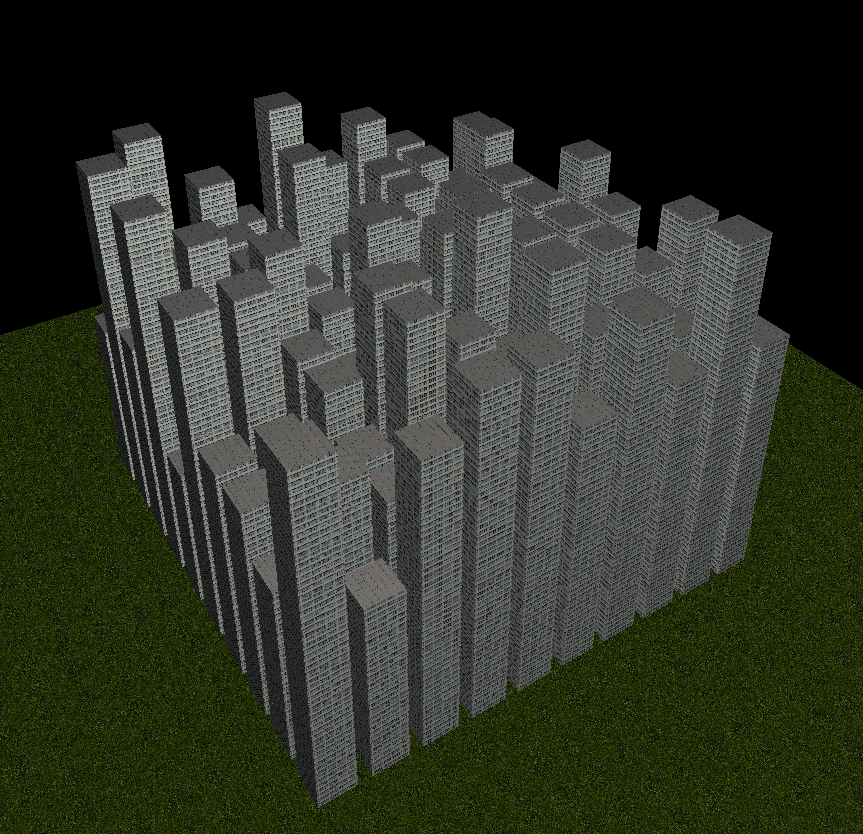

# Procedural-Modeling-of-Buildings

Implemention of the state-of-the-art techniques from the area of computer
graphics

#### Goals:
- Implementation of a procedural modeling program
- Automatic generation of Building geometry

#### Tasks:
- Parsing: specify a grammar file format
- Modelling: implement derivation tree
- Visualization: draw derivation tree (with OpenGL)

### Obtained results:

